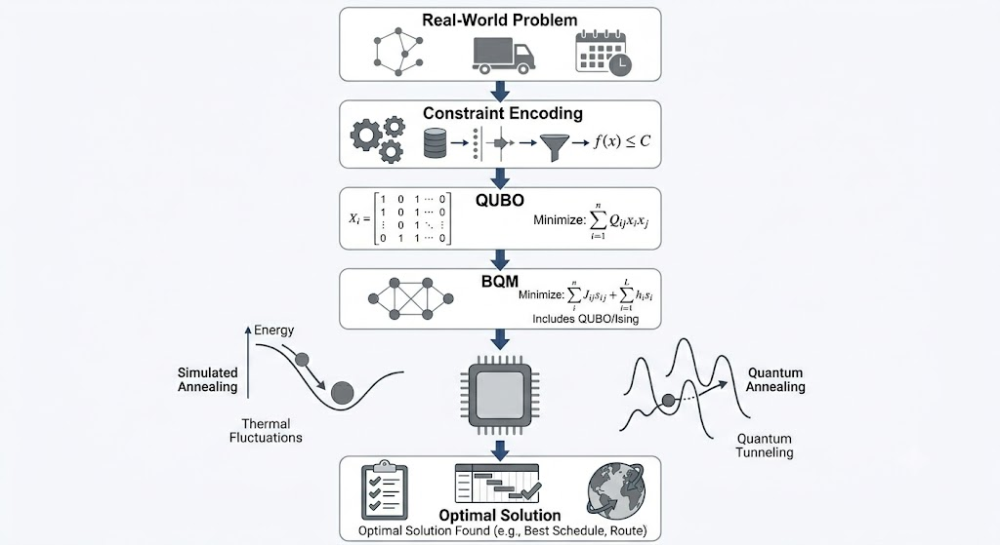

# Quantum Optimization with D-Wave

A collection of notebooks exploring quantum optimization techniques using D-Wave's Ocean SDK, Binary Quadratic Models (BQMs), Ising formulations, QUBO models, and quantum annealing.

This repository provides a practical introduction to formulating and solving combinatorial optimization problems using both classical and quantum-inspired approaches.

---
## Optimization Workflow


---
## Overview

Many real-world optimization problems can be expressed as:

- Ising Models
- Quadratic Unconstrained Binary Optimization (QUBO) Models
- Binary Quadratic Models (BQMs)

These formulations enable the use of optimization techniques such as:

- Simulated Annealing
- Quantum Annealing
- Hybrid Quantum-Classical Solvers

This repository demonstrates the complete workflow from problem formulation to solution using D-Wave's Ocean ecosystem.

---

## Topics Covered

### Simulated Annealing

Introduction to stochastic optimization using temperature-based search methods.

Key Concepts:
- Energy minimization
- Temperature schedules
- Local search
- Escaping local minima

---

### QUBO Formulation and Penalty Methods

Learn how constrained optimization problems can be converted into unconstrained QUBO models through penalty terms.

Key Concepts:
- Constraint encoding
- Objective functions
- Penalty coefficients
- Binary optimization

---

### Ising Models

Understanding spin-based optimization and its relationship with QUBO formulations.

Key Concepts:
- Spins (+1/-1)
- Coupling coefficients
- Local fields
- Ground states

---

### Binary Quadratic Models (BQMs)

Introduction to the fundamental model used throughout D-Wave's optimization framework.

Key Concepts:
- Linear biases
- Quadratic biases
- Energy landscapes
- Model construction

---

### Graph Coloring using BQMs

Application of BQMs to solve graph coloring problems.

Key Concepts:
- Constraint satisfaction
- Combinatorial optimization
- Graph theory
- QUBO encoding

---

### Higher-Order Models and Quadratization

Techniques for converting higher-order optimization problems into quadratic forms suitable for annealing hardware.

Key Concepts:
- Higher-order interactions
- Auxiliary variables
- Quadratization methods
- Model reduction

---

### Quantum Annealing

Introduction to quantum annealing and optimization using D-Wave systems.

Key Concepts:
- Quantum fluctuations
- Tunneling
- Annealing schedules
- Energy minimization

---

### Hybrid Quantum-Classical Solvers

Using D-Wave's hybrid solvers to tackle larger optimization problems.

Key Concepts:
- Problem decomposition
- Hybrid workflows
- Classical preprocessing
- Quantum refinement

---

## Repository Structure

```text
Quantum-Optimization-DWave/
│
├── 01_Simulated_Annealing.ipynb
├── 02_QUBO_Penalty_Methods.ipynb
├── 03_Ising_QUBO_Conversion.ipynb
├── 04_BQM_Basics.ipynb
├── 05_Graph_Coloring_BQM.ipynb
├── 06_Higher_Order_Quadratization.ipynb
├── 07_Quantum_Annealing_DWave.ipynb
├── 08_DWave_Hybrid_Solvers.ipynb
│
├── requirements.txt
└── README.md
```

---

## Installation

Clone the repository:

```bash
git clone https://github.com/YOUR_USERNAME/Quantum-Optimization-DWave.git

cd Quantum-Optimization-DWave
```

Create a virtual environment:

```bash
python -m venv venv
```

Activate the environment:

### Windows

```bash
venv\Scripts\activate
```

### Linux / macOS

```bash
source venv/bin/activate
```

Install dependencies:

```bash
pip install -r requirements.txt
```

---

## Requirements

Main dependencies include:

- NumPy
- D-Wave Ocean SDK
- Dimod
- Neal
- NetworkX
- D-Wave NetworkX

---

## Learning Path

Recommended order:

1. Simulated Annealing
2. QUBO Penalty Methods
3. Ising Models
4. Binary Quadratic Models
5. Graph Coloring
6. Higher-Order Optimization
7. Quantum Annealing
8. Hybrid Solvers

Each notebook builds on concepts introduced in previous notebooks.

---

## Technologies Used

- Python
- D-Wave Ocean SDK
- Dimod
- Neal
- NetworkX
- Jupyter Notebooks

---

## Applications

The techniques demonstrated here are relevant to:

- Resource Allocation
- Scheduling
- Routing Problems
- Network Optimization
- Constraint Satisfaction Problems
- Cybersecurity Optimization
- Scientific Computing
- Operations Research

---

## References

- D-Wave Ocean SDK Documentation
- D-Wave Leap Platform
- Quantum Annealing Literature
- Binary Quadratic Model Formulations

---

## Author

**Shriram**

Interests:
- Quantum Computing
- Quantum Machine Learning
- Quantum Optimization
- Graph Neural Networks
- Scientific Computing

GitHub: https://github.com/Shr-i-ram

---
